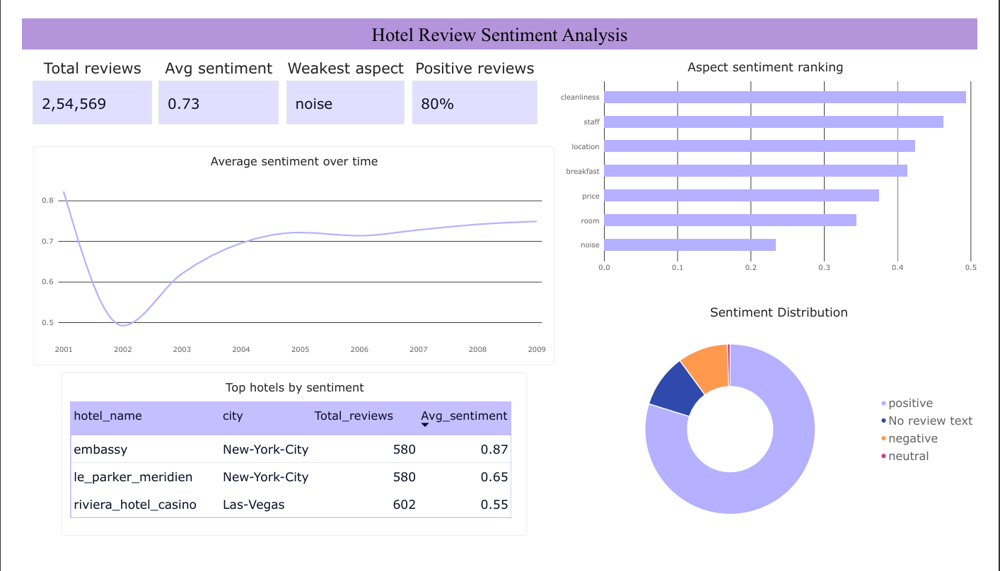

# Hotel Review Analytics Pipeline

An end-to-end pipeline that turns messy, unstructured hotel review text into
structured sentiment and aspect-level insights, loaded into MySQL and
visualized in Power BI.

Built using the [OpinRank Review Dataset](http://www.kavita-ganesan.com/entity-ranking-data)
(~259,000 hotel reviews across 10 cities, scraped from TripAdvisor).

## Dashboard



Power BI file: [`powerbi/hotel_review_dashboard.pbix`](powerbi/hotel_review_dashboard.pbix)

## Pipeline stages

1. **Ingestion** (`src/data_ingestion.py`) — walks the raw dataset folders
   (one per city, one file per hotel), parses tab-separated review lines,
   handles inconsistent encodings, and logs malformed rows instead of
   silently dropping data.
2. **Cleaning** (`src/data_cleaning.py`) — decodes HTML entities, strips
   encoding artifacts, standardizes whitespace, parses review dates, and
   removes exact duplicates.
3. **NLP** (`src/nlp_processing.py`) — computes document-level sentiment
   (NLTK/VADER) per review, plus sentence-level aspect sentiment for
   room, staff, location, breakfast, price, cleanliness, and noise.
4. **Database load** (`src/db_loader.py`) — creates a MySQL schema
   (`hotels`, `reviews`, `review_aspects`) and loads the processed data.
5. **Power BI dashboard** — sentiment overview, aspect ranking, sentiment
   trend over time, and top hotels by sentiment. Hotel names and country
   were further cleaned in Power Query.

## Key findings

- Reviews skew strongly positive overall (~80% positive, avg sentiment +0.73).
- **Noise** is consistently the weakest aspect across hotels (avg sentiment
  0.23), while **cleanliness** scores highest (0.49).
- Document-level sentiment is too coarse for aspect analysis — an early
  version showed "noise" as positive because a complaint sentence was
  outweighed by the rest of an otherwise positive review. Switching to
  sentence-level aspect sentiment fixed this (see Key design decisions).
- 2001 has very few reviews (n=20), so the sentiment trend for that year is
  noisy and not statistically meaningful — kept in the chart as-is, but
  worth noting when interpreting the trend line.

## Tech stack

Python, pandas, NLTK/VADER, MySQL, SQLAlchemy, Power BI

## Project structure

```
├── config/            # Centralized paths, constants, DB config
├── loggers/           # Shared logging configuration
├── src/               # Production pipeline scripts
│   ├── data_ingestion.py
│   ├── data_cleaning.py
│   ├── nlp_processing.py
│   └── db_loader.py
├── notebooks/         # Exploratory notebooks (one per pipeline stage)
├── powerbi/           # Power BI dashboard (.pbix) and screenshot
├── data/              # Raw and processed data (not committed - see .gitignore)
├── logs/              # Runtime logs (not committed)
└── main.py            # Runs all pipeline stages end to end
```

## Setup

1. Clone the repo and create a virtual environment:
   ```
   python -m venv venv
   venv\Scripts\activate      # Windows
   pip install -r requirements.txt
   ```
2. Download the OpinRank dataset and place hotel review folders under
   `data/hotels/`.
3. Set your MySQL credentials as environment variables:
   ```
   $env:MYSQL_USER = "root"
   $env:MYSQL_PASSWORD = "your_password"
   ```
4. Run the full pipeline:
   ```
   python main.py
   ```
   or run each stage individually:
   ```
   python -m src.data_ingestion
   python -m src.data_cleaning
   python -m src.nlp_processing
   python -m src.db_loader
   ```

## Key design decisions

- **NLTK/VADER over a transformer model** for sentiment — fast enough to
  run on 250K+ reviews without a GPU, and well-suited to short, informal
  review text.
- **Sentence-level aspect sentiment**, not document-level — an earlier
  version scored aspects using whole-review sentiment, which incorrectly
  showed complaints (e.g. "noise") as positive whenever the rest of the
  review was upbeat. Splitting into sentences and scoring only the
  sentence(s) mentioning each aspect fixed this.
- **Config-driven paths and constants** (`config/config.py`) instead of
  hardcoded values, so the pipeline runs consistently across machines.

## Status

Complete: ingestion, cleaning, NLP, MySQL loading, and Power BI dashboard.